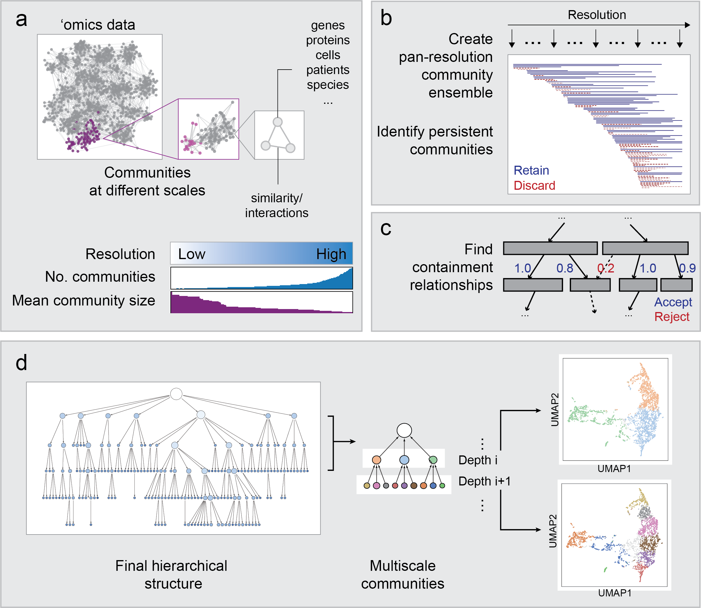

# HiDeF (Hierarchical community Decoding Framework)



## Introduction

HiDeF is an analysis framework to robustly resolve the hierarchical structures of networks based on multiscale community detection and the concepts of persistent homology. It is a collaboration between teams in UC San Diego and University of Pittsburgh. It is associated with the following manuscript:

Fan Zheng, She Zhang, Christopher Churas, Dexter Pratt, Ivet Bahar, Trey Ideker. Submitted (2020) [Preprint]()

## Dependencies

[networkx](https://networkx.github.io/) 2.3  
[python-igraph](https://igraph.org/python/) 0.7.1  
[louvain-igraph](https://github.com/vtraag/louvain-igraph) 0.6.1  
[leidenalg](https://github.com/vtraag/leidenalg)    0.7.0  
numpy  
scipy  
pandas


## Usage

We provide multiple options to perform the HiDeF analysis.

### Running HiDeF from Cytoscape (Recommended)

HiDeF has been fully integrated with the [Cytoscape](https://cytoscape.org/) environment, via our recently released [Community Detection APplication and Service (CDAPS)](http://apps.cytoscape.org/apps/cycommunitydetection) framework. Documentations can be found in the link above.

By using this option, users can leverage the computing power of [National Resources of Network Biology (NRNB)](https://nrnb.org/) for the HiDeF analysis, and enjoy other nice features provided in the CDAPS framework, including (1) interact with the source network to visualize the subnetwork of any detected community (2) perform gene set enrichment analysis (when the vertices of the source network are proteins/genes) (3) store and share the models via the [NDEx](http://www.ndexbio.org/) database.


### Running HiDeF as a command-line tool

Using the codes in this repository, HiDeF can be used as a command-line tool. There are two main components of the scripts: `finder.py` and `weaver.py`.


To sweep the resolution profile and generate an optimized hierarchy based on pan-resolution community persistence, run the following command in a terminal: 

`python finder.py --g $graph --n $n --o $out [--options]`

- `$graph`: a tab delimited file with 2-3 columns: nodeA, nodeB, weight (optional).
- `$maxres`: the upper limit of the sampled range of the resolution parameter.
- `$out`: a prefix string for the output files.  

Other auxiliary parameters are explained in the supplemental material of the manuscript.

#### Outputs
- `$out.nodes`: A TSV file describing the content (nodes in the input network) of each community. The last column of this file contains the persistence of each community.  
- `$out.edges`: A TSV file describing the parent-child relationships of communities in the hierarchy. The parent communities are in the 1st column and the children communities are in the 2nd column.  
- `$out.gml`: A file in the GML format that can be opened in Cytoscape to visualize the hierarchy (using "yFiles hierarchic layout" in Cytoscape)


### Using HiDeF as a python package.

The following example shows how to build a hierarchical view of a network based on pre-computed communities, by using HiDeF as a Python package. This workflow only involves `weaver.py`.

First, the user needs to provide the clustering results on these data points. These results may be obtained from any multilevel clustering algorithm of user's choice. In this example, suppose we have 8 data points and define 7 ways of partitioning them (in a Python terminal), 

```
>>> P = ['11111111',
...      '11111100',
...      '00001111',
...      '11100000',
...      '00110000',
...      '00001100',
...      '00000011']
```

The labels of these nodes are assigned as follows (optional):

```
>>> nodes = 'ABCDEFGH'
```

Then the hierarchical view can be obtained by

```
>>> from hidef import weaver
>>> weaver = Weaver(P, boolean=True, terminals=nodes, assume_levels=False)
>>> T = weaver.weave(cutoff=0.9, top=10)
```

The hierarchy is represented by a `networkx.DiGraph` object, which can be obtained by querying `T.hier`. `T` also contains a lot of useful functions for extracting useful information about the hierarchy. 
